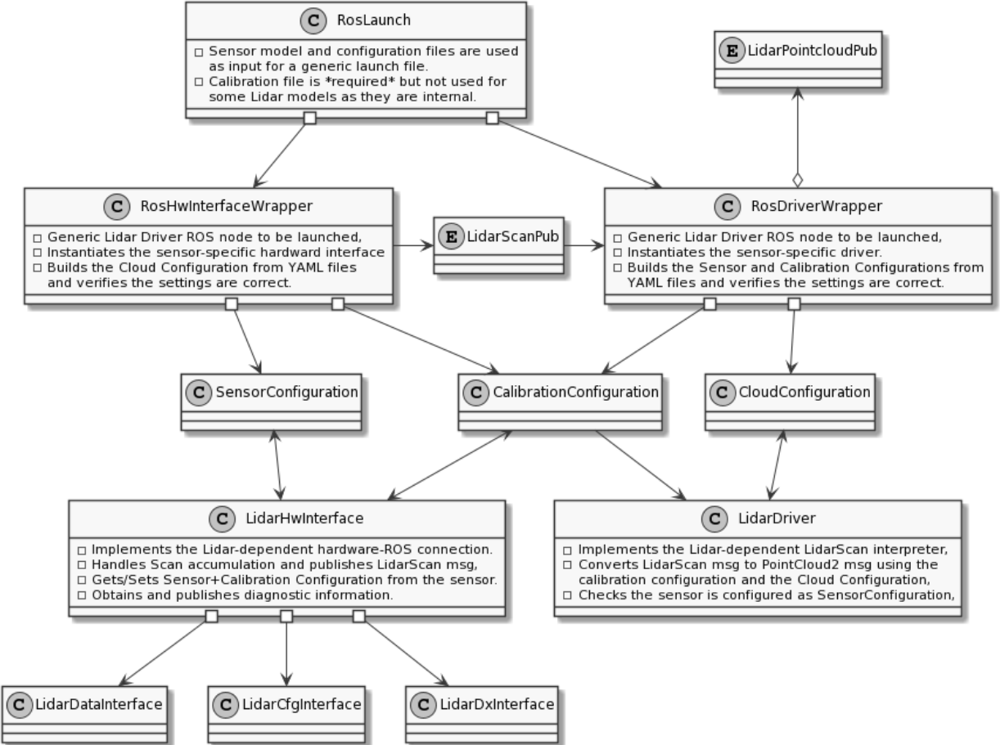

# Nebula Lidar Driver

## How to build

Builds on ROS Galactic and Humble. Be sure to install dependencies using `rosdep`:

```rosdep install --from-paths src --ignore-src -y -r```

A [TCP enabled version of ROS' Transport Driver](https://github.com/MapIV/transport_drivers/tree/tcp) is required to use Nebula. You can install it manually or pull it inside this repository using vcs:

```vcs import . < build_depends.repos```

Then compile with colcon, optionally enabling symlink:

```colcon build --symlink-install --cmake-args -DCMAKE_BUILD_TYPE=Release```

## How to run Tests

Run tests:

```
$ colcon test --event-handlers console_cohesion+
```

Show results:
```
$ colcon test-result --all
```

## Generic Launch File
You can easily run the sensor hardware interface, the sensor hardware monitor and sensor driver using (e.g. Pandar64):

```ros2 launch nebula_lidar_driver nebula_launch.py sensor_model:=Pandar64```

If you don't want to launch the hardware (i.e. working on rosbag) set the `launch_hw` flag to false:

```ros2 launch nebula_lidar_driver nebula_launch.py sensor_model:=Pandar64 launch_hw:=false```

You should ideally provide a config file for your specific sensor, but default ones are provided `nebula_drivers/config`

```ros2 launch nebula_lidar_driver nebula_launch.py sensor_model:=Pandar64 config_file:=your_sensor.yaml```

## Hesai LiDARs
Supported models, where sensor_model is the ROS param to be used at launch:

| Model         | sensor_model   | Config   |
|---------------|----------------|----------|
| Pandar 64     | Pandar64       | 64.csv   |
| Pandar 40P    | Pandar40P      | 40p.csv  |
| Pandar XT 32  | PandarXT32     | xt32.csv |
| Pandar QT 64  | PandarQT64     | qt.csv   |
| ------------- | -------------- | -------- |

Supported return modes:

| Mode               | return_mode     |
|--------------------|-----------------|
| Single (First)     | SingleFirst     |
| Single (Strongest) | SingleStrongest |
| Single (Last)      | SingleLast      |
| Dual               | Dual            | 
| ------------------ | --------------- |

Common ROS params:

| Parameter       | Type   | Default     | Accepted Values            | Description      |
|-----------------|--------|-------------|----------------------------|------------------|
| sensor_model    | string |             | See supported models       |                  |
| return_mode     | string |             | See supported return modes |                  |
| frame_id        | string | pandar      |                            | ROS frame ID     |
| scan_phase      | double | 0           | degrees [0, 360[           | Scan start angle |

### Hesai Hardware Interface
Launches the UDP hardware connection to a live sensor and publishes HesaiScan messages. E.g.:
```ros2 launch nebula_lidar_driver hesai_hw_interface.xml sensor_model:=Pandar40P return_mode:=Dual```
Unique params:

| Parameter       | Type   | Default     | Accepted Values   | Description     |
|-----------------|--------|-------------|-------------------|-----------------|
| sensor_ip       | string | 192.168.0.1 |                   | Sensor IP       |
| host_ip         | string | 192.168.0.1 |                   | Host IP         |
| data_port       | uint16 | 2368        |                   | Sensor port     |
| gnss_port       | uint16 | 2369        |                   | GNSS port       |
| frequency_ms    | uint16 | 100         | milliseconds, > 0 | Time per scan   |
| packet_mtu_size | uint16 | 1500        |                   | Packet MTU size |


### Hesai Driver
Launches the hesai driver which subscribes to HesaiScan messages and converts them to PointCloud2. E.g.:
```ros2 launch nebula_lidar_driver hesai_driver.xml sensor_model:=Pandar40P return_mode:=Dual```
Unique params:

| Parameter       | Type   | Default     | Accepted Values | Description            |
|-----------------|--------|-------------|-----------------|------------------------|
| calibration_file| string |             |                 | LiDAR calibration file |


## Velodyne LiDARs
| Model                 | sensor_model   | Config             |
|-----------------------|----------------|--------------------|
| VLP-16                | VLP16          | VLP16.yaml         |
| VLP-16-HiRes          | VLP16          | VLP16_hires.yaml   |
| VLP-32                | VLP32          | VLP32.yaml         | 
| VLS-128 (Alpha Prime) | HDL64          | VLS128.yaml        |
|  |  |  |
| Untested:             |                |                    |
| HDL-32                | PandarQT64     | HDL32.yaml         |
| HDL-64E (default)     | HDL64          | HDL64e_utexas.yaml |              
| HDL-64E S2            | HDL64          | HDL64e_s2.yaml     |
| HDL-64E S3            | HDL64          | HDL64e_s3.yaml     |

Supported return modes:

| Mode               | return_mode     |
|--------------------|-----------------|
| Single (First)     | SingleFirst     |
| Single (Strongest) | SingleStrongest |
| Single (Last)      | SingleLast      |
| Dual               | Dual            | 

Common ROS params:

| Parameter       | Type   | Default     | Accepted Values            | Description      |
|-----------------|--------|-------------|----------------------------|------------------|
| sensor_model    | string |             | See supported models       |                  |
| return_mode     | string |             | See supported return modes |                  |
| frame_id        | string | pandar      |                            | ROS frame ID     |
| scan_phase      | double | 0           | degrees [0, 360[           | Scan start angle |

### Velodyne Hardware Interface
Launches the UDP hardware connection to a live sensor and publishes VelodyneScan messages. E.g.:
```ros2 launch nebula_lidar_driver velodyne_hw_interface.xml sensor_model:=VLS128 return_mode:=Dual```
Unique params:

| Parameter       | Type   | Default     | Accepted Values | Description      |
|-----------------|--------|-------------|-----------------|------------------|
| sensor_ip       | string | 192.168.0.1 |                 | Sensor IP        |
| data_port       | uint16 | 2368        |                 | Sensor port      |
| gnss_port       | uint16 | 2369        |                 | GNSS port        |
| frequency_ms    | uint16 | 100         | ms, > 0         | Time per scan    |
| packet_mtu_size | uint16 | 1500        |                 | Packet MTU size  |

### Velodyne Driver
Launches the Velodyne driver which subscribes to VelodyneScan messages and converts them to PointCloud2. E.g.:
```ros2 launch nebula_lidar_driver velodyne_driver.xml sensor_model:=VLS128 return_mode:=Dual```
Unique params:

| Parameter        | Type   | Default | Accepted Values  | Description                             |
|------------------|--------|---------|------------------|-----------------------------------------|
| calibration_file | string |         |                  | LiDAR calibration file                  |
| min_range        | double | 0.3     | meters, >= 0.3   | Minimum point range published           | 
| max_range        | double | 300     | meters, <= 300   | Maximum point range published           |
| view_width       | double | 360     | degrees ]0, 360] | Horizontal FOV centered at `scan_phase` |

## Diagrams


