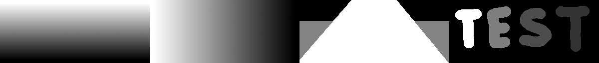
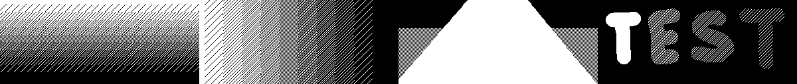
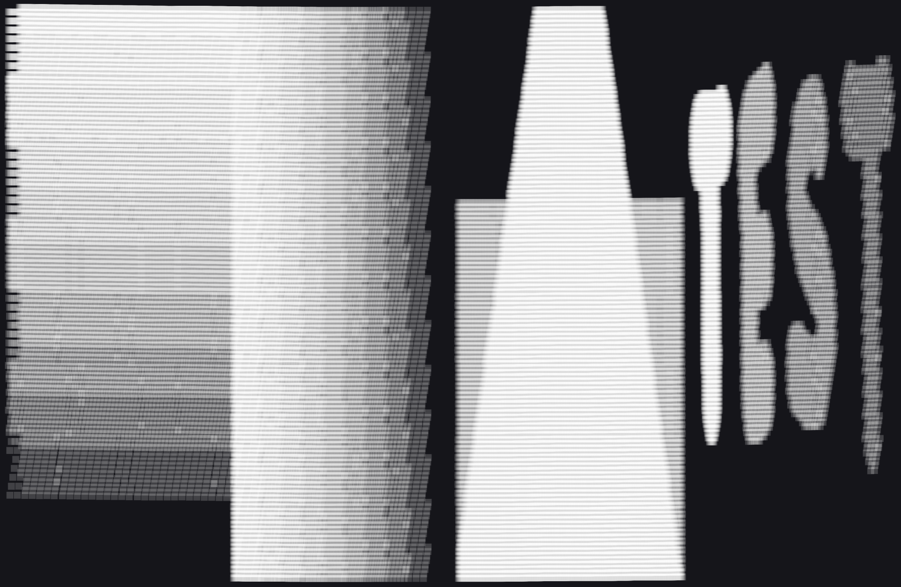
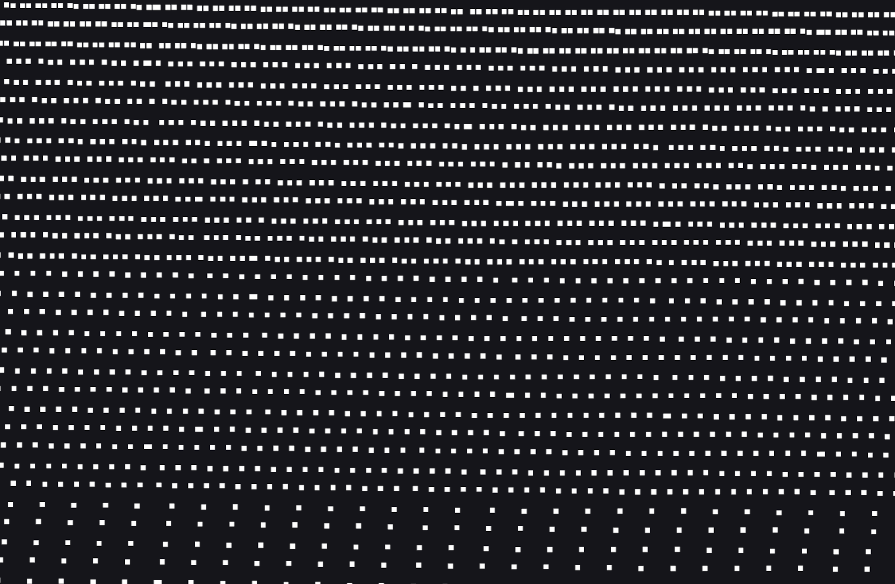

# Point Filters

Point filters run for every decoded point, reducing pointcloud size right at the decode stage.
This can speed up the later parts of pointcloud processing pipelines by reducing the number of points copied between and processed by modules.

## Configuration

Filters are configured via the ROS parameter namespace `point_filters`.

```yaml
{
  point_filters:
    filter_type_a:
      parameter_1: 5
      parameter_2: "abc"
    filter_type_b:
      # ...
}
```

Where each `filter_type` can be specified at most once.
The configuration options available depend on the respective filter type.

Filters can also be set during runtime, e.g. via:

```shell
# replace <vendor> with the name of a supported vendor
ros2 param set /<vendor>_ros_wrapper_node point_filters.filter_type_a ...'
```

## Supported Filters

The following filter types are supported:

| Filter Name            | Filter Type       | Hesai | Robosense | Velodyne |
| ---------------------- | ----------------- | :---: | :-------: | :------: |
| Downsample Mask Filter | `downsample_mask` |  ✅   |    ❌     |    ❌    |

Compatibility:  
✅: compatible  
❌: incompatible

Below, each filter type is documented in detail.

### Downsample Mask Filter

This filter takes a greyscale PNG image that represents polar coordinates (x=azimuth, y=elevation)
and downsamples the pointcloud according to the lightness values of the image's pixels.

<!-- prettier-ignore-start -->
!!! note
    For ring-based sensors, `y` represents the `channel` as a proxy for `elevation`.
    The image height has to be equal to the sensor's number of channels.
<!-- prettier-ignore-end -->

The input image is dithered to a boolean mask:

| Stage                                      |                         Image                         |
| :----------------------------------------- | :---------------------------------------------------: |
| Input greyscale mask                       |          |
| Internal dithered mask generated by Nebula |  |

The decoded points are then kept/discarded based on that mask:

|                                                                                                |                                        |
| ----------------------------------------------------------------------------------------------------------------------------------------------------- | ----------------------------------------------------------------------------------------------------- |
| Pointcloud output. The original pointcloud had uniform density (all white). 2D azimuth-elevation view, points are blurred to better visualize density | Close-up view of a region with multiple different downsampling levels (bottom left of the pointcloud) |

#### Configuration Options

Configuration is done in the following format:

```yaml
downsample_mask:
  path: /path/to/mask.png
```

Or, during runtime, by setting:

```shell
ros2 param set /<vendor>_ros_wrapper_node point_filters.downsample_mask.path /path/to/mask.png'
```

The filter can be disabled by omitting the `downsample_mask` config item, or by setting `path` to an empty string:

```shell
ros2 param set /<vendor>_ros_wrapper_node point_filters.downsample_mask.path ""'
```

The required resolution of the mask is sensor-dependent:

| Sensor Model | Required Resolution |
| ------------ | ------------------- |
| Pandar40P    | 1800 x 40           |
| Pandar64     | 1800 x 64           |
| PandarXT16   | 2000 x 16           |
| PandarXT32   | 2000 x 32           |
| PandarXT32M  | 2000 x 32           |
| PandarAT128  | 1200 x 128          |
| PandarQT64   | 600 x 64            |
| PandarQT128  | 900 x 128           |
| Pandar128E4X | 3600 x 128          |

<!-- prettier-ignore-start -->
!!! warning
    If the mask resolution does not match the required resolution, Nebula will not start (if configured on launch) or reject the setting (if set during runtime).
<!-- prettier-ignore-end -->

#### Behavior

<!-- prettier-ignore-start -->
!!! warning
    Color spaces in image editors can be confusing and can lead to unexpected results (more/less downsampling than expected).
    To work on monochrome images, use the `Grayscale` color mode and use the `Value` in the HSV color space to choose greyscale values.
    For example, a `Value` (HSV) of 50% is equal to a downsampling factor of 2, but a `Luminosity` (LCh) of 50% is equal to a downsampling factor of 2.17.
    Check the generated `_dithered.png` mask to see whether you are getting the expected results.
<!-- prettier-ignore-end -->

- Greyscale values are quantized to the nearest 10th (yielding 11 quantization levels in total)
- Mask resolution is dictated by the sensor's maximum FoV, the number of channels (for rotational LiDARs) and the peak angular resolution:
  - For a 40-channel LiDAR with `360 deg` FoV and `0.1 deg` peak azimuth resolution, the mask has to be `(360 / 0.1, 40) = (3600, 40)` pixels
  - Currently, non-rotational LiDARs are not yet supported
- Dithering performed by Nebula is spatial only, meaning that it stays constant over time. Decoded points are checked against the nearest pixel in the dithered mask
