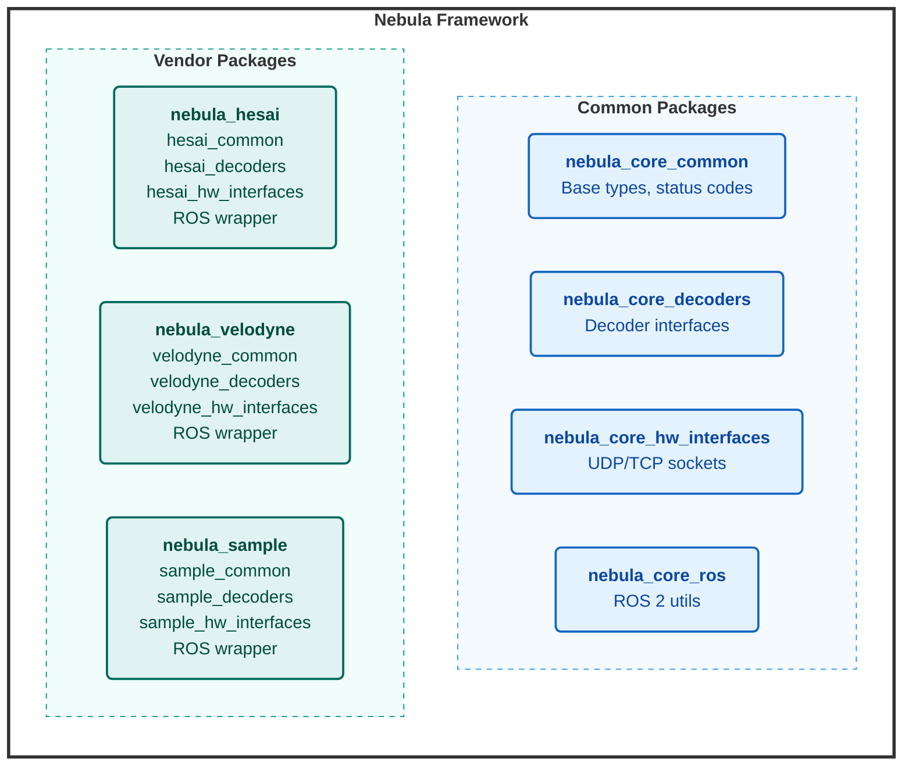
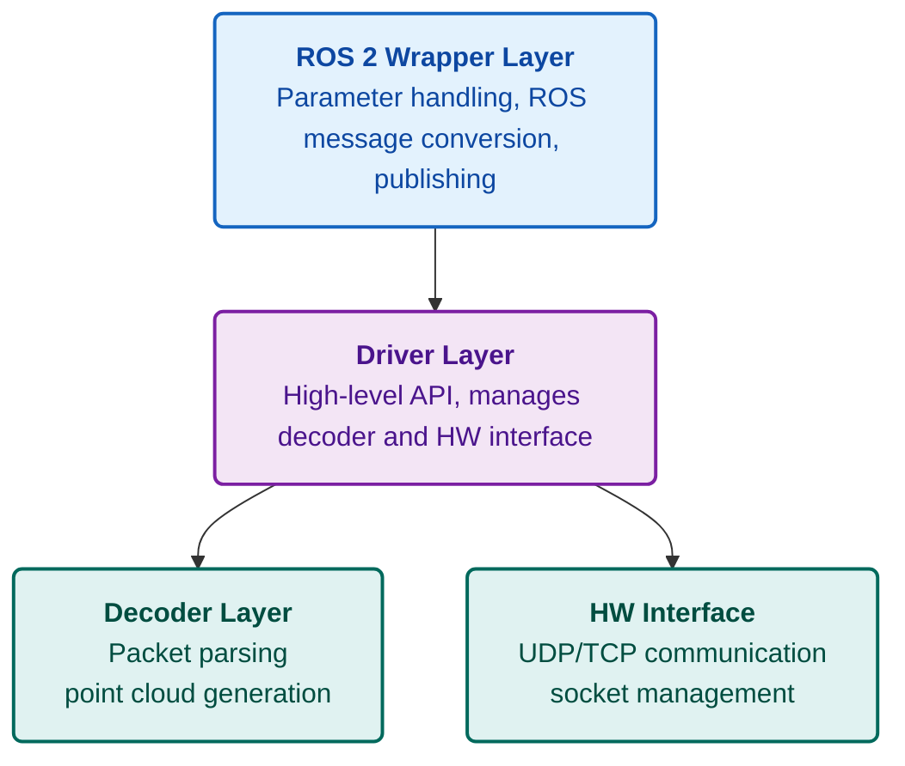

# New Sensor Integration Guide

This guide provides instructions for adding support for a new LiDAR sensor to Nebula using the `nebula_sample` package as a template.

## Table of Contents

1. [Architecture Overview](#architecture-overview)
2. [Provided Components](#provided-components)
3. [Integration Workflow](#integration-workflow)
4. [Implementation Details](#implementation-details)
5. [Required Behaviors](#required-behaviors)
6. [Verification](#verification)

---

## Architecture Overview

### Overall Package Structure

Nebula is organized into common (reusable) packages and vendor-specific packages:



**Key Principles**:

- **Common packages** provide reusable functionality (UDP sockets, point types, etc.)
- **Vendor packages** implement vendor-specific logic (packet parsing, calibration)
- All vendor packages follow the **same 4-layer structure** for consistency
- Vendor packages **depend on** common packages but not on each other

### Layered Architecture (Per Vendor)

Each vendor package uses a layered architecture to separate functional blocks and promote code reuse:



### Data Flow

1. **Hardware Interface** receives raw UDP packets from the sensor and defines TCP protocols for communication and configuration
2. **Driver** receives packets and delegates to **Decoder**
3. **Decoder** parses packets, accumulates points, detects scan completion, and calls callback with complete point cloud
4. **ROS Wrapper** converts to ROS message and publishes

---

## Provided Components

Nebula provides reusable components to simplify sensor integration. You should use these instead of implementing from scratch.

### 1. UDP Socket Handling

**Location**: `nebula_core_hw_interfaces/include/nebula_core_hw_interfaces/nebula_hw_interfaces_common/connections/udp.hpp`

**What it provides**:

- Asynchronous UDP socket
- Automatic packet reception loop
- Callback-based packet delivery
- Metadata (timestamp, source IP) for each packet

**Usage**:

```cpp
#include "nebula_core_hw_interfaces/nebula_hw_interfaces_common/connections/udp.hpp"

// In your HW interface:
connections::UdpSocket udp_socket_;

// Start receiving:
udp_socket_.open(host_ip, port);
udp_socket_.bind();
udp_socket_.asyncReceive(callback);
```

### 2. Status Codes

**Location**: `nebula_core_common/include/nebula_core_common/nebula_status.hpp`

**What it provides**:

- Standardized error/success codes
- `Status` enum with values like `OK`, `INVALID_CALIBRATION_FILE`, `SENSOR_CONFIG_ERROR`, etc.

**Usage**:

```cpp
#include "nebula_core_common/nebula_status.hpp"

nebula::Status validate_config() {
  if (!config_valid) {
    return Status::SENSOR_CONFIG_ERROR;
  }
  return Status::OK;
}
```

### 3. Point Cloud Types

**Location**: `nebula_core_common/include/nebula_core_common/point_types.hpp`

**What it provides**:

- `NebulaPoint` - Standard point type with x, y, z, intensity, timestamp, return_type, channel, azimuth, elevation, distance
- `NebulaPointCloud` - PCL point cloud of NebulaPoints
- Conversion utilities to ROS/Autoware point types

**Usage**:

```cpp
#include "nebula_core_common/point_types.hpp"

NebulaPointCloudPtr cloud = std::make_shared<NebulaPointCloud>();
NebulaPoint point;
point.x = distance * sin_azimuth * cos_elevation;
point.y = distance * cos_azimuth * cos_elevation;
point.z = distance * sin_elevation;
cloud->push_back(point);
```

### 4. Angle Utilities

**Location**: `nebula_core_decoders/include/nebula_core_decoders/angles.hpp`

**What it provides**:

- `deg2rad()`, `rad2deg()` - Angle conversions
- `angle_is_between()` - Check if angle is within FOV
- Angle normalization functions

**Usage**:

```cpp
#include "nebula_core_decoders/angles.hpp"

float azimuth_rad = deg2rad(azimuth_deg);
bool in_fov = angle_is_between(fov_min, fov_max, azimuth_rad);
```

### 5. Configuration Base Classes

**Location**: `nebula_core_common/include/nebula_core_common/nebula_common.hpp`

**What it provides**:

- `LidarConfigurationBase` - Base for sensor configuration (frame_id, sensor_model, return_mode, etc.)
- `CalibrationConfigurationBase` - Base for calibration data

**Usage**:

```cpp
struct MySensorConfiguration : public LidarConfigurationBase {
  std::string sensor_ip;
  uint16_t data_port;
  // ... sensor-specific fields
};
```

### 6. Logger Integration

**Location**: `nebula_core_common/include/nebula_core_common/loggers/logger.hpp`

**What it provides**:

- Unified logging interface
- ROS 2 logger wrapper (`RclcppLogger`)
- Macros: `NEBULA_LOG_STREAM(logger->info, "message")`

**Usage**:

```cpp
#include "nebula_core_common/loggers/logger.hpp"

std::shared_ptr<loggers::Logger> logger_;
NEBULA_LOG_STREAM(logger_->error, "Failed to parse packet");
```

### 7. Diagnostic Integration

**Location**: ROS 2 `diagnostic_updater` package (used in ROS wrapper)

**What it provides**:

- Automatic diagnostic publishing
- Status monitoring (OK, WARN, ERROR)
- Rate monitoring for scan frequency

**Usage**:

```cpp
#include <diagnostic_updater/diagnostic_updater.hpp>

diagnostic_updater::Updater diagnostic_updater_;
// Add diagnostics in your ROS wrapper
```

---

## Integration Workflow

### Step 1: Clone the Template

Copy the `nebula_sample` directory:

```bash
cd src
cp -r nebula_sample nebula_myvendor
```

### Step 2: Rename Components

Rename all occurrences of "sample"/"Sample" to your vendor name:

- **Directories**: `nebula_sample_*` → `nebula_myvendor_*`
- **Files**: `sample_*.{cpp,hpp}` → `myvendor_*.{cpp,hpp}`
- **Classes**: `SampleDriver` → `MyVendorDriver`
- **Namespaces**: Update in all files
- **CMake/Package**: Update `CMakeLists.txt` and `package.xml`

**Tip**: Use find-and-replace tools:

```bash
find nebula_myvendor -type f -exec sed -i 's/sample/myvendor/g' {} +
find nebula_myvendor -type f -exec sed -i 's/Sample/MyVendor/g' {} +
```

### Step 3: Implement Components

See [Implementation Details](#implementation-details) below.

### Step 4: Verify

See [Verification](#verification) below.

---

## Implementation Details

### A. Common Package (`nebula_myvendor_common`)

**Purpose**: Define configuration and calibration structures.

#### 1. Sensor Configuration

Edit `include/nebula_myvendor_common/myvendor_common.hpp`:

```cpp
struct MyVendorSensorConfiguration : public LidarConfigurationBase {
  // Network settings
  std::string sensor_ip{"192.168.1.201"};
  std::string host_ip{"192.168.1.100"};
  uint16_t data_port{2368};

  // Sensor settings
  uint16_t rotation_speed{600};  // RPM
  uint16_t cloud_min_angle{0};
  uint16_t cloud_max_angle{360};

  // Add your sensor-specific fields
};
```

#### 2. Calibration Configuration (Optional)

Only implement if your sensor needs calibration data:

```cpp
struct MyVendorCalibrationConfiguration : public CalibrationConfigurationBase {
  std::vector<float> elevation_angles;
  std::vector<float> azimuth_offsets;

  Status load_from_file(const std::string & calibration_file) override {
    // Parse your calibration file format (CSV, XML, binary, etc.)
    // Populate elevation_angles and azimuth_offsets
    return Status::OK;
  }
};
```

### B. Decoders Package (`nebula_myvendor_decoders`)

**Purpose**: Parse packets and generate point clouds.

#### 1. Decoder Interface

The interface is already defined in `myvendor_scan_decoder.hpp`. You don't need to modify it.

#### 2. Decoder Implementation

Edit `include/nebula_myvendor_decoders/decoders/myvendor_decoder.hpp`:

```cpp
class MyVendorDecoder : public MyVendorScanDecoder {
public:
  explicit MyVendorDecoder(
    const std::shared_ptr<const MyVendorSensorConfiguration> & config)
  : config_(config) {
    current_cloud_ = std::make_shared<NebulaPointCloud>();
    current_cloud_->reserve(100000);  // Pre-allocate
  }

  PacketDecodeResult unpack(const std::vector<uint8_t> & packet) override {
    // 1. Validate packet size
    if (packet.size() != EXPECTED_PACKET_SIZE) {
      return {{}, DecodeError::INVALID_PACKET_SIZE};
    }

    // 2. Parse packet header
    uint64_t timestamp_ns = parse_timestamp(packet);
    uint16_t azimuth = parse_azimuth(packet);

    // 3. Extract and convert points
    for (int block = 0; block < NUM_BLOCKS; ++block) {
      for (int channel = 0; channel < NUM_CHANNELS; ++channel) {
        uint16_t distance_raw = parse_distance(packet, block, channel);
        uint8_t intensity = parse_intensity(packet, block, channel);

        // Convert to 3D point
        NebulaPoint point = convert_to_point(
          distance_raw, intensity, azimuth, channel, timestamp_ns);
        current_cloud_->push_back(point);
      }
    }

    // 4. Detect scan completion (azimuth wrap)
    bool scan_complete = (azimuth < last_azimuth_);
    last_azimuth_ = azimuth;

    // 5. If scan complete, call callback
    if (scan_complete && pointcloud_callback_) {
      pointcloud_callback_(current_cloud_, timestamp_ns * 1e-9);
      current_cloud_ = std::make_shared<NebulaPointCloud>();
      current_cloud_->reserve(100000);
    }

    // 6. Return result
    PacketMetadata metadata;
    metadata.packet_timestamp_ns = timestamp_ns;
    metadata.did_scan_complete = scan_complete;
    return {{}, metadata};
  }

private:
  std::shared_ptr<const MyVendorSensorConfiguration> config_;
  NebulaPointCloudPtr current_cloud_;
  uint16_t last_azimuth_{0};
  pointcloud_callback_t pointcloud_callback_;
};
```

#### 3. Driver Implementation

The driver is a thin wrapper. Edit `src/myvendor_driver.cpp`:

```cpp
MyVendorDriver::MyVendorDriver(
  const std::shared_ptr<const MyVendorSensorConfiguration> & config)
: config_(config) {
  scan_decoder_ = std::make_shared<MyVendorDecoder>(config);
  driver_status_ = Status::OK;
}

PacketDecodeResult MyVendorDriver::parse_cloud_packet(
  const std::vector<uint8_t> & packet) {
  return scan_decoder_->unpack(packet);
}
```

### C. Hardware Interfaces Package (`nebula_myvendor_hw_interfaces`)

**Purpose**: Manage UDP communication with the sensor.

Edit `src/myvendor_hw_interface.cpp`:

```cpp
Status MyVendorHwInterface::sensor_interface_start() {
  if (!sensor_configuration_) {
    return Status::SENSOR_CONFIG_ERROR;
  }

  // Create UDP socket using Nebula's UdpSocket
  udp_socket_ = std::make_unique<connections::UdpSocket>();

  // Open and bind
  udp_socket_->open(
    sensor_configuration_->host_ip,
    sensor_configuration_->data_port);
  udp_socket_->bind();

  // Start async receive with callback
  udp_socket_->asyncReceive(
    [this](const std::vector<uint8_t> & buffer,
           const connections::UdpSocket::RxMetadata & metadata) {
      if (cloud_packet_callback_) {
        cloud_packet_callback_(buffer, metadata);
      }
    });

  return Status::OK;
}

Status MyVendorHwInterface::sensor_interface_stop() {
  if (udp_socket_) {
    udp_socket_->close();
    udp_socket_.reset();
  }
  return Status::OK;
}
```

### D. ROS Wrapper Package (`nebula_myvendor`)

**Purpose**: Bridge C++ driver with ROS 2.

Edit `src/myvendor_ros_wrapper.cpp`:

```cpp
MyVendorRosWrapper::MyVendorRosWrapper(const rclcpp::NodeOptions & options)
: Node("nebula_myvendor_ros_wrapper", options) {

  // 1. Declare ROS parameters
  declare_parameter("sensor_ip", "192.168.1.201");
  declare_parameter("host_ip", "192.168.1.100");
  declare_parameter("data_port", 2368);
  declare_parameter("frame_id", "myvendor_lidar");
  declare_parameter("launch_hw", true);

  // 2. Create sensor configuration
  sensor_cfg_ptr_ = std::make_shared<MyVendorSensorConfiguration>();
  sensor_cfg_ptr_->sensor_ip = get_parameter("sensor_ip").as_string();
  sensor_cfg_ptr_->host_ip = get_parameter("host_ip").as_string();
  sensor_cfg_ptr_->data_port = get_parameter("data_port").as_int();
  sensor_cfg_ptr_->frame_id = get_parameter("frame_id").as_string();
  launch_hw_ = get_parameter("launch_hw").as_bool();

  // 3. Initialize driver
  driver_ptr_ = std::make_shared<MyVendorDriver>(sensor_cfg_ptr_);

  // 4. Register pointcloud callback
  driver_ptr_->set_pointcloud_callback(
    [this](const NebulaPointCloudPtr & cloud, double timestamp_s) {
      auto ros_msg = std::make_unique<sensor_msgs::msg::PointCloud2>();
      pcl::toROSMsg(*cloud, *ros_msg);
      ros_msg->header.stamp = rclcpp::Time(timestamp_s * 1e9);
      ros_msg->header.frame_id = sensor_cfg_ptr_->frame_id;
      points_pub_->publish(std::move(ros_msg));
    });

  // 5. Initialize HW interface
  if (launch_hw_) {
    hw_interface_ptr_ = std::make_shared<MyVendorHwInterface>();
    hw_interface_ptr_->set_sensor_configuration(sensor_cfg_ptr_);
    hw_interface_ptr_->register_scan_callback(
      [this](const std::vector<uint8_t> & packet, const auto & metadata) {
        (void)metadata;
        driver_ptr_->parse_cloud_packet(packet);
      });
  }

  // 6. Create publisher
  points_pub_ = create_publisher<sensor_msgs::msg::PointCloud2>(
    "points", rclcpp::SensorDataQoS());
}

Status MyVendorRosWrapper::stream_start() {
  if (hw_interface_ptr_) {
    return hw_interface_ptr_->sensor_interface_start();
  }
  return Status::OK;
}
```

---

## Required Behaviors

Your sensor integration must implement these behaviors correctly.

### 1. Startup Sequence

**Order of operations**:

1. **Parameter Loading**: Declare and read all ROS parameters
2. **Configuration Validation**: Validate IP addresses, ports, ranges
3. **Driver Initialization**: Create driver with validated config
4. **Callback Registration**: Register pointcloud callback
5. **HW Interface Initialization**: Create and configure HW interface
6. **Publisher Creation**: Create ROS publishers
7. **Stream Start**: Call `sensor_interface_start()` to begin receiving data

**Error Handling**:

- If any step fails, log error and throw exception
- Do not proceed to next step if previous failed
- Clean up resources on failure

**Example**:

```cpp
// In constructor
try {
  load_parameters();
  validate_configuration();
  initialize_driver();
  register_callbacks();
  initialize_hw_interface();
  create_publishers();
} catch (const std::exception & e) {
  RCLCPP_ERROR(get_logger(), "Initialization failed: %s", e.what());
  throw;
}

// In separate method or after construction
stream_start();
```

### 2. Reconfiguration

**When parameters change at runtime**:

1. **Validate New Parameters**: Check if new values are valid
2. **Stop Stream**: Call `sensor_interface_stop()`
3. **Update Configuration**: Apply new parameter values
4. **Reinitialize Driver**: Create new driver with updated config
5. **Restart Stream**: Call `sensor_interface_start()`

**Example**:

```cpp
rcl_interfaces::msg::SetParametersResult on_parameter_change(
  const std::vector<rclcpp::Parameter> & parameters) {

  auto result = rcl_interfaces::msg::SetParametersResult();
  result.successful = true;

  // Validate parameters
  for (const auto & param : parameters) {
    if (param.get_name() == "rotation_speed") {
      if (param.as_int() < 300 || param.as_int() > 1200) {
        result.successful = false;
        result.reason = "Invalid rotation speed";
        return result;
      }
    }
  }

  // Apply changes
  sensor_interface_stop();
  update_configuration(parameters);
  reinitialize_driver();
  sensor_interface_start();

  return result;
}
```

### 3. Connection Loss Handling

**Detect and handle sensor disconnection**:

1. **Timeout Detection**: Monitor time since last packet
2. **Diagnostic Update**: Set diagnostic status to ERROR
3. **Logging**: Log connection loss with timestamp
4. **Recovery**: Optionally attempt reconnection

**Example**:

```cpp
// In packet callback
void receive_packet_callback(const std::vector<uint8_t> & packet) {
  last_packet_time_ = now();

  // Process packet...
}

// In timer callback (e.g., 1 Hz)
void check_connection() {
  auto time_since_last_packet = now() - last_packet_time_;

  if (time_since_last_packet > timeout_threshold_) {
    RCLCPP_ERROR(get_logger(), "Connection lost - no packets for %.1fs",
                 time_since_last_packet.seconds());

    // Update diagnostics
    diagnostic_updater_.broadcast(
      diagnostic_msgs::msg::DiagnosticStatus::ERROR,
      "Connection lost");

    // Optionally attempt reconnection
    attempt_reconnection();
  }
}
```

### 4. Shutdown Sequence

**Order of operations**:

1. **Stop Stream**: Call `sensor_interface_stop()`
2. **Close Sockets**: Ensure all network resources are closed
3. **Clear Buffers**: Release point cloud buffers
4. **Reset Pointers**: Reset shared_ptr members

**Example**:

```cpp
~MyVendorRosWrapper() {
  if (hw_interface_ptr_) {
    hw_interface_ptr_->sensor_interface_stop();
  }

  driver_ptr_.reset();
  hw_interface_ptr_.reset();
}
```

### 5. Diagnostic Reporting

**Required diagnostic information**:

- **Packet Rate**: Packets received per second
- **Scan Rate**: Complete scans per second (should match rotation speed)
- **Connection Status**: OK / WARN / ERROR
- **Decode Errors**: Count of failed packet parses

**Example**:

```cpp
diagnostic_updater::Updater diagnostic_updater_;

// In constructor
diagnostic_updater_.setHardwareID("MyVendor LiDAR");
diagnostic_updater_.add("Scan Rate", this, &MyVendorRosWrapper::check_scan_rate);

// Diagnostic function
void check_scan_rate(diagnostic_updater::DiagnosticStatusWrapper & stat) {
  double expected_rate = sensor_cfg_ptr_->rotation_speed / 60.0;  // Hz
  double actual_rate = measured_scan_rate_;

  if (std::abs(actual_rate - expected_rate) < 0.5) {
    stat.summary(diagnostic_msgs::msg::DiagnosticStatus::OK, "Scan rate OK");
  } else {
    stat.summary(diagnostic_msgs::msg::DiagnosticStatus::WARN, "Scan rate mismatch");
  }

  stat.add("Expected (Hz)", expected_rate);
  stat.add("Actual (Hz)", actual_rate);
}
```

---

## Verification

### 1. Build

```bash
colcon build --packages-up-to nebula_myvendor
source install/setup.bash
```

### 2. Launch

```bash
ros2 launch nebula_myvendor nebula_myvendor.launch.xml
```

### 3. Verify Topics

```bash
# List topics
ros2 topic list

# Check point cloud
ros2 topic echo /points --field header

# Monitor frequency
ros2 topic hz /points
```

### 4. Visualize

```bash
rviz2
# Add PointCloud2 display
# Set topic to /points
# Set Fixed Frame to your frame_id
```

### 5. Check Diagnostics

```bash
ros2 topic echo /diagnostics
```

### 6. Test with PCAP (Offline)

```bash
# Set launch_hw:=false to use PCAP playback
ros2 launch nebula_myvendor nebula_myvendor.launch.xml launch_hw:=false

# In another terminal, play PCAP
ros2 bag play your_sensor_data.bag
```

---

## Integration Checklist

- [ ] Cloned and renamed all files and directories
- [ ] Updated `CMakeLists.txt` in all packages
- [ ] Updated `package.xml` in all packages
- [ ] Implemented `SensorConfiguration` struct
- [ ] Implemented `unpack()` method in Decoder
- [ ] Implemented scan completion detection
- [ ] Implemented UDP reception in HW Interface
- [ ] Mapped ROS parameters in Wrapper
- [ ] Implemented startup sequence
- [ ] Implemented shutdown sequence
- [ ] Added diagnostic reporting
- [ ] Added connection loss handling
- [ ] Added copyright headers
- [ ] Verified build succeeds
- [ ] Verified point cloud publishes
- [ ] Verified scan rate matches expected
- [ ] Tested with real sensor or PCAP data

---

## Additional Resources

- **Hesai Implementation**: `src/nebula_hesai` - Full reference implementation
- **Velodyne Implementation**: `src/nebula_velodyne` - Alternative reference
- **Core Components**: `src/nebula_core` - Reusable utilities
- **Point Types**: See `docs/point_types.md`
- **Parameters**: See `docs/parameters.md`

## Getting Help

- Check existing sensor implementations for examples
- Review inline code documentation (Doxygen comments)
- Consult the API reference documentation
- Ask questions in [GitHub Issues](https://github.com/YOUR_ORG/YOUR_REPO/issues)
