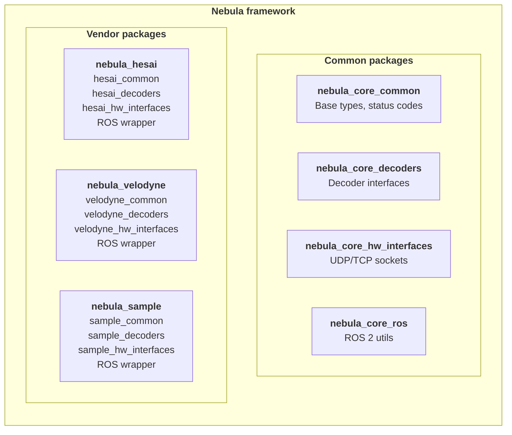
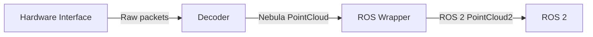

# Integrating a new Sensor

This guide provides instructions for adding support for a new sensor to Nebula. We provide a
template implementation (`nebula_sample`) and reusable components to simplify the process.

## Architecture overview

### Overall package structure

Nebula is organized into corepackages and vendor-specific packages:


```mermaid
graph TB

    %% --- GRAPH STRUCTURE ---
    subgraph Nebula["<b>Nebula framework</b>"]
        direction TB

        subgraph Common["<b>Common packages</b>"]
            direction LR
            C1["<b>nebula_core_common</b><br/>Base types, status codes"]
            C2["<b>nebula_core_decoders</b><br/>Decoder interfaces"]
            C3["<b>nebula_core_hw_interfaces</b><br/>UDP/TCP sockets"]
            C4["<b>nebula_core_ros</b><br/>ROS 2 utils"]
        end

        subgraph Vendors["<b>Vendor packages</b>"]
            direction LR
            Hesai["<b>nebula_hesai</b><br/>hesai_common<br/>hesai_decoders<br/>hesai_hw_interfaces<br/>ROS wrapper"]

            Velodyne["<b>nebula_velodyne</b><br/>velodyne_common<br/>velodyne_decoders<br/>velodyne_hw_interfaces<br/>ROS wrapper"]

            Sample["<b>nebula_sample</b><br/>sample_common<br/>sample_decoders<br/>sample_hw_interfaces<br/>ROS wrapper"]
        end
    end


```

- Core packages provide reusable functionality (UDP sockets, point types, etc.)
- Vendor packages implement vendor-specific logic (packet parsing, calibration)
- Vendor packages are typically split into `common`, `decoders`, `hw_interfaces` and
  `ROS wrapper`:
  - `common`: Vendor-specific types, internal interfaces and utilities
  - `decoders`: Packet parsing and conversion to point clouds
  - `hw_interfaces`: Network communication
  - `ROS wrapper`: ROS 2 node, parameters, publishers, orchestration
- Vendor packages depend on core packages but not on each other

Except for the ROS wrappers, no package should depend on ROS 2. This allows users to run parts
of Nebula as a library e.g. in ML pipelines without ROS 2.

!!! warning
Existing vendor implementations do not strictly follow this architecture as the project
evolved over time. New implementations should follow the architecture described here.

### Data Flow

Packets flow from the hardware interface to the decoder to the ROS wrapper as follows:


```mermaid
flowchart LR
    HW[Hardware Interface] -->| Raw packets | DC[Decoder]
    DC -->| Nebula PointCloud | RW[ROS Wrapper]
    RW -->| ROS 2 PointCloud2 | ROS[ROS 2]
```

Since decoder and HW interface are separate libraries, the ROS wrapper sets up the data flow
between them on startup by registering callbacks.

## Component Library

Nebula provides reusable components to simplify sensor integration. Use these components to
reduce boilerplate code and ensure consistent behavior across sensors and vendors.

### UDP socket handling

```cpp
--8<-- "src/nebula_core/nebula_core_hw_interfaces/examples/udp_socket_usage_example.cpp:include"
```

**What it provides**:

- UDP socket with easy builder-style configuration
- Threaded packet reception with user-defined callback
- Metadata (socket timestamp, buffer overflow count) for each packet

**Usage**:

```cpp
--8<-- "src/nebula_core/nebula_core_hw_interfaces/examples/udp_socket_usage_example.cpp:usage"
```

### Expected

```c++
--8<-- "src/nebula_core/nebula_core_common/examples/expected_usage_example.cpp:include"
```

**What it provides**:

For operations that can fail, but should not crash the program, return values via
`nebula::util::expected<T, E>`. Avoid sentinel return values (e.g., `nullptr`, `-1`) and
exceptions. This keeps APIs explicit about what can fail:

**Usage**:

```cpp
--8<-- "src/nebula_core/nebula_core_common/examples/expected_usage_example.cpp:usage"
```

!!! tip
If the happy path has no meaningful return value, use `std::monostate` (a type with no data) as
`T`:

    ```cpp
    nebula::util::expected<std::monostate, ErrorCode> do_something();
    ```

### Point cloud types

```c++
--8<-- "src/nebula_core/nebula_core_ros/examples/point_types_usage_example.cpp:include"
```

**What it provides**:

- `NebulaPoint` - Standard point type with x, y, z, intensity, timestamp, return_type, channel,
  azimuth, elevation, distance
- `NebulaPointCloud` - Point cloud of NebulaPoints
- Conversion utilities to ROS/Autoware point types

Nebula point types are designed for compatibility with and efficiency of downstream tasks.
Since Nebula is the official sensor driver framework for Autoware, using Nebula point types
ensures seamless integration with Autoware components.

**Usage**:

```cpp
--8<-- "src/nebula_core/nebula_core_ros/examples/point_types_usage_example.cpp:usage"
```

### Angle utilities

```c++
--8<-- "src/nebula_core/nebula_core_common/examples/angle_utilities_usage_example.cpp:include"
```

**What it provides**:

- `deg2rad()`, `rad2deg()` - Angle conversions
- `angle_is_between()` - Angle checks with wrap-around support
- Angle normalization functions

**Usage**:

```c++
--8<-- "src/nebula_core/nebula_core_common/examples/angle_utilities_usage_example.cpp:usage"
```

### Logger integration

```c++
--8<-- "src/nebula_core/nebula_core_common/examples/logger_integration_usage_example.cpp:include"
```

**What it provides**:

- Unified logging interface via `Logger`
- ROS 2 logger wrapper (`RclcppLogger`)
- Macros: `NEBULA_LOG_STREAM(logger->info, "message")`

This is a dependency-injection pattern: non-ROS (ROS-independent) modules log through the generic
`loggers::Logger` interface, while the ROS wrapper can provide a `RclcppLogger` implementation so
those modules still log into ROS 2.

**Usage**:

```cpp
--8<-- "src/nebula_core/nebula_core_common/examples/logger_integration_usage_example.cpp:usage"
```

### Diagnostic integration

```c++
--8<-- "src/nebula_core/nebula_core_ros/examples/diagnostic_integration_usage_example.cpp:include"
```

**What it provides**:

- Diagnostic task helpers used across Nebula (e.g., `RateBoundStatus`, `LivenessMonitor`)
- Consistent patterns for publish-rate and liveness monitoring

**Usage**:

```cpp
--8<-- "src/nebula_core/nebula_core_ros/examples/diagnostic_integration_usage_example.cpp:usage"
```

## Integration workflow

### Step 1: Clone and rename template

Copy the `nebula_sample` directory:

```bash
cd src
cp -r nebula_sample nebula_myvendor
```

### Step 2: Rename components

Rename all occurrences of "sample"/"Sample" to your vendor name:

- Directories: `nebula_sample_*` → `nebula_myvendor_*`
- Files: `sample_*.{cpp,hpp}` → `myvendor_*.{cpp,hpp}`
- Classes: Rename wrapper / decoder / HW interface classes (e.g., `SampleRosWrapper`,
  `SampleDecoder`, `SampleHwInterface`)
- Namespaces: Update in all files
- CMake/package: Update `CMakeLists.txt` and `package.xml`

Tip: Use find-and-replace tools:

```bash
find nebula_myvendor -type f -exec sed -i 's/sample/myvendor/g' {} +
find nebula_myvendor -type f -exec sed -i 's/Sample/MyVendor/g' {} +
```

### Step 3: Implement components

See [Implementation details](#implementation-details) below.

### Step 4: Verify

See [Verification](#verification) below.

## Implementation details

The `nebula_sample` package provides a template implementation. Its source files contain
comments and TODOs throughout to guide you through the implementation.

Some examples might not be relevant for your sensor, e.g. calibration handling. Implement only
what is necessary for your sensor.

### About SDK integration

If you are a sensor vendor with your own SDK, you might be able to replace parts of the decoder
and HW interface with calls to the SDK. Integrate your SDK either through Git submodules, or
by adding it to `build_depends.repos`.

!!! warning
Nebula is licensed under the Apache 2.0 license and has a strict no-binaries policy. Ensure
that your SDK _source code_ is public, and ensure that your SDK license allows shipping as
part of an Apache 2.0 project.

Please ensure that the SDK is fit for automotive use cases (real-time, safety, reliability).
Nebula interfaces like

- `/nebula_points` (including correct point types)
- `/nebula_packets` (publish and replay)
- `/diagnostics`
- launch patterns

must be implemented correctly.

## Required behaviors

Your sensor integration must implement these behaviors correctly.

### Startup sequence

Order of operations:

1. Parameter loading: Declare and read ROS parameters
2. Configuration validation: Validate IP addresses, ports, ranges
3. Decoder initialization: Create decoder with validated config
4. Callback registration: Register pointcloud callback
5. HW interface initialization: Create and configure HW interface
6. Publisher creation: Create ROS publishers
7. Stream start: Call `sensor_interface_start()` to begin receiving data

### Reconfiguration (optional)

When parameters change at runtime:

1. Validate new parameters: Check if new values are valid
2. Update configuration: Apply new parameter values
3. Reinitialize driver: Create new driver with updated config

### Connection loss handling

Detect and handle sensor disconnection:

1. Timeout detection: Monitor time since last packet
2. Diagnostic update: Set diagnostic status to `ERROR`
3. Logging: Log connection loss only on state changes (avoid log spam)
4. Recovery: Attempt reconnection transparently

### Shutdown sequence

Order of operations:

Prefer RAII-based shutdown: sockets/threads/buffers should be owned by objects whose destructors
stop/join/close automatically, so the wrapper does not require sensor-specific shutdown logic.

1. Stop stream: Ensure receiver threads stop and join
2. Close sockets: Ensure all network resources are closed
3. Release buffers: Release point cloud buffers
4. Destroy owners: Destroy the owning objects (RAII)

### Diagnostic reporting

Required diagnostic information:

- Publish rate: Use `custom_diagnostic_tasks::RateBoundStatus`
- Liveness: Use `nebula::ros::LivenessMonitor`
- Debug timings: Publish receive/decode/publish durations for profiling

## Verification

This section contains basic commands you can use to verify your implementation.

### Build and test

Build and test both have to succeed without warnings or errors.

```bash
colcon build --packages-up-to nebula_myvendor
# This tests all myvendor packages
colcon test --packages-select-regex nebula_myvendor
colcon test-result --verbose
```

### Live testing

For testing with a real sensor, launch Nebula with your sensor model:

```bash
# From your package
ros2 launch nebula_myvendor nebula_myvendor.launch.xml sensor_model:=mysensor
# From the `nebula` package
ros2 launch nebula nebula_launch.py sensor_model:=mysensor
```

To record a rosbag of Nebula packet output for later replay:

```bash
ros2 bag record /nebula_packets -o mysensor_packets
```

### Replay testing

You can test Nebula offline with the rosbag recorded above:

```bash
# Set launch_hw:=false to use rosbag replay
ros2 launch nebula_myvendor nebula_myvendor.launch.xml launch_hw:=false

# In another terminal, play the recorded ROS 2 bag
ros2 bag play mysensor_packets
```

## Integration checklist

### Basic setup

- [ ] Copied and renamed `nebula_sample` to `nebula_myvendor`
- [ ] Renamed all occurrences of "sample"/"Sample" to your vendor name
- [ ] Updated `package.xml`s with author and package info
- [ ] Updated copyright headers

### Implementation tasks

- [ ] Implemented `SensorConfiguration` struct
- [ ] Mapped ROS parameters in Wrapper
- [ ] Implemented `unpack()` method in Decoder
- [ ] Implemented scan completion detection
- [ ] Implemented communication in HW Interface
- [ ] Implemented startup sequence
- [ ] Implemented shutdown sequence
- [ ] Added diagnostic reporting
- [ ] Added connection loss handling

### Verification tasks

- [ ] Verified build succeeds without warnings
- [ ] Verified point cloud publishes
- [ ] Verified scan rate matches expected
- [ ] Verified diagnostics report correctly
- [ ] Tested with real sensor
- [ ] Tested rosbag recording of Nebula packet output
- [ ] Tested rosbag replay with `launch_hw:=false`

## Additional resources

- Hesai implementation: `src/nebula_hesai` - Full reference implementation
- Velodyne implementation: `src/nebula_velodyne` - Alternative reference
- Core components: `src/nebula_core` - Reusable building blocks
- Point types: See `docs/point_types.md`
- Parameters: See `docs/parameters.md`

## Getting help

- Check existing sensor implementations for examples
- Consult the [API reference](https://tier4.github.io/nebula/api_reference/)
- Ask questions in [GitHub Issues](https://github.com/tier4/nebula/issues)
