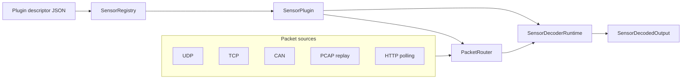

#Vendor - neutral runtime interface

The vendor-neutral runtime interface is Nebula's generic layer for loading
sensor plugins, routing raw packets, and running decoders in live or replay
sessions without depending on ROS 2 or vendor-specific wrappers.

This layer is intentionally not a complete sensor implementation. It provides
the stable contracts and runtime composition that vendor adapters can plug into.
Vendor-specific parsing, calibration handling, and model behavior remain in
vendor packages.

## Why this exists

Historically, Nebula integrations were usually built around a ROS wrapper,
vendor decoder classes, and vendor hardware interfaces. That works for deployed
drivers, but it makes it difficult to:

- reuse decoders outside ROS 2,
- discover sensors and schemas programmatically,
- run the same packet path for live traffic and PCAP replay,
- test generic runtime behavior without vendor hardware, and
- add new vendors without copying orchestration code.

The runtime interface addresses those problems by separating generic runtime
concerns from sensor-specific implementation.

## Naming

The extraction branch is named `feat/vendor_neutral_runtime_interface`. In
public documentation and PR text, use `vendor-neutral runtime interface`.

Avoid calling this layer a harness. The runtime interface is broader than a
test harness because it includes plugin contracts, packet sources, packet
routing, and session runners. It is narrower than a full driver because it does
not publish ROS topics, own launch files, or implement production vendor
adapters by itself.

## Package map

| Package | Responsibility |
| --- | --- |
| `nebula_core_common` | ROS-free packet, output, radar, status, configuration, progress, and error types. |
| `nebula_core_decoders` | `SensorPlugin`, `SensorDecoderRuntime`, packet requirements, and live transport requirements. |
| `nebula_core_hw_interfaces` | Reusable packet sources and connection primitives for UDP, TCP, CAN, HTTP, HTTP control, and PCAP replay. |
| `nebula_core_runtime` | Plugin registry, packet router, replay session runner, and live transport graph. |
| `nebula_sample_common` | Sample plugin descriptor and schema assets. |
| `nebula_sample_decoders` | Reference plugin and decoder runtime implementation. |

## Architecture



The main boundary is between generic runtime code and plugin code:

- Generic runtime code owns discovery, packet sources, routing, and session
  lifecycle.
- Plugin code describes what packets it accepts, what live transports it needs,
  and how to decode routed packets into typed outputs.

## Core contracts

### `SensorPacket`

`SensorPacket` is the generic raw packet container. It carries:

- the transport kind, such as UDP, TCP, CAN, HTTP, or replay metadata,
- the routed packet channel, such as data, info, status, control, correction, or
  radar,
- timestamp and replay metadata,
- source/destination endpoint metadata or CAN metadata, and
- the raw packet payload bytes.

Replay uses the same transport identity as live data. For example, a UDP packet
read from a PCAP is still emitted as `SensorTransportKind::UDP` with
`from_replay = true`. This keeps live and replay traffic on the same decoder
path.

### `SensorDecodedOutput`

`SensorDecodedOutput` is the generic decoded output container. Its payload is a
bounded variant of Nebula-owned, ROS-free output types:

- point clouds,
- radar detections,
- radar objects,
- status,
- diagnostics, and
- telemetry.

The variant is deliberately bounded. New output categories should be added to
the common contract instead of using an untyped payload escape hatch.

### `SensorConfiguration`

`SensorConfiguration` contains generic fields shared by sensor families:

- model,
- frame and network identity,
- data and GNSS ports,
- calibration file,
- return mode,
- field of view,
- range limits,
- rotation speed, and
- string key-value `extra_params` for vendor-specific parameters.

It extends the existing `LidarConfigurationBase` hierarchy instead of creating a
second independent representation for common model, frame, Ethernet, return
mode, and range fields. Runtime-specific fields such as GNSS port, calibration
assets, field of view, and `extra_params` are layered on top.

Plugin runtimes should map this generic configuration into their internal
vendor-specific configuration structs during `configure()`.

### `SensorPlugin`

Each plugin implements `SensorPlugin`. The plugin is responsible for:

- returning metadata and supported models,
- declaring packet-channel requirements,
- declaring live transport requirements, and
- constructing a decoder runtime.

The runtime does not hard-code vendor packet ports, CAN IDs, or packet layout
rules. It asks the plugin for those requirements and configures routing from
that declaration.

### `SensorDecoderRuntime`

Each plugin creates a `SensorDecoderRuntime`. The runtime is responsible for:

- configuring the decoder from `SensorConfiguration`,
- receiving routed `SensorPacket` objects,
- emitting `SensorDecodedOutput`,
- reporting `SensorError`, and
- reporting `SensorProgress`.

The decoder runtime should return `SensorPacketResult::Buffered` when a packet
was accepted but does not yet produce output, `Success` when packet processing
completed successfully, `Ignored` for irrelevant packets, and `Error` for
decoder failures.

## Plugin descriptors

Plugins are discovered through JSON descriptors. A minimal descriptor looks like
this:

```json
{
  "vendor" : "nebula",
             "package" : "nebula_sample_decoders",
                         "library" : "libnebula_sample_decoders_plugin.so",
                                     "factory" : "create_nebula_sensor_plugin",
                                                 "models" : ["Sample"],
                                                            "schema" : "schemas/sample.schema.json"
}
```

    Descriptor fields :

  |
  Field | Required | Meaning | | -- - | -- - | -- - | | `vendor` | Yes | Vendor or
  owner name.| | `package` | Yes | Plugin package name.This is also the registry key.| | `library` |
    Yes | Shared library path or
  library filename
      .Relative paths are resolved from the descriptor directory and known install prefixes.|
    | `factory` | No |
    C symbol used to create the plugin.Defaults to `create_nebula_sensor_plugin`.| | `models` |
    Yes | Sensor model names supported by the plugin.| | `schema` | No | Relative or
  absolute path to a configuration schema.| | `config_defaults` | No | Relative or
  absolute path to default configuration assets.| | `calibration_assets` | No | Relative or
  absolute path to calibration assets.|

`SensorRegistry` can load descriptors from explicit directories and from these environment
      variables :

  - `NEBULA_PLUGINS_PATH`,
  - `AMENT_PREFIX_PATH`,
  and- `COLCON_PREFIX_PATH`.

       Relative schema /
      config /
      calibration paths are resolved relative to the descriptor file.This allows tools to discover
        plugin assets without vendor -
    specific search logic.

    Plugin shared libraries must export both lifecycle functions :

```cpp
#include <nebula_core_decoders/sensor_plugin_export.hpp>

  extern "C" nebula::drivers::SensorPlugin *
  create_nebula_sensor_plugin();
extern "C" void destroy_nebula_sensor_plugin(nebula::drivers::SensorPlugin * plugin);
```

The registry calls the destroy function through a custom deleter and keeps the
plugin library loaded until the last plugin instance is destroyed. Do not rely
on callers deleting plugin objects directly.

## Packet routing

`PacketRouter` maps incoming packets to plugin-declared packet channels.

For UDP and TCP packets, routing can match by destination port and optional
payload signature. For CAN packets, routing can match by CAN ID and optional
payload signature. A payload signature contains:

- an offset,
- expected bytes, and
- an optional byte mask.

Use payload signatures when multiple packet types share the same transport
endpoint. Use channels to communicate packet meaning to the decoder runtime.
For example, a LiDAR plugin can route measurement packets to `Data` and
calibration/info packets to `Info`.

## Live transport requirements

Plugins declare live transport requirements through
`live_transport_requirements()`. The live graph currently supports:

- UDP packet sources,
- TCP packet sources,
- CAN packet sources, and
- HTTP control endpoints.

HTTP control requirements are modeled as request/response endpoints, not as
packet streams. `HttpPacketSource` remains available for sensors that expose
polling-style telemetry, but live control should use `HttpControlEndpoint`.

Malformed required transport declarations should fail during live graph
configuration. For example, UDP, TCP, and HTTP requirements need a port.

## Replay sessions

`ReplaySessionRunner` composes:

1. `SensorRegistry`,
2. the selected plugin,
3. `PcapPacketSource`,
4. `PacketRouter`, and
5. the plugin's decoder runtime.

Replay validates PCAP files during configuration, so missing files and
unsupported link types fail before the worker thread starts. PCAP UDP packets
preserve their UDP transport and are marked with `from_replay`.

Replay is intended to test the same decoder path as live data. There is no
separate replay transport kind;
decoders should use `from_replay` only when they need to distinguish recorded packets from live
  packets.

  ##Live sessions

`LiveTransportGraph` composes :

  1. `SensorRegistry`,
  2. the selected plugin, 3. transport sources based on plugin requirements, 4. `PacketRouter`,
  and5. the plugin's decoder runtime.

     The graph serializes packet delivery into the decoder runtime
       .Transport errors and decoder errors are reported through the configured error
         callback.Callbacks are stored on the graph and forwarded through stable internal wrappers,
  so callbacks can be installed before or
    after configuration without reconfiguring packet sources or
    decoder runtimes
        .

      User callbacks are invoked outside the graph state mutex.This avoids forcing application
        callbacks to be non -
      reentrant and allows callback code to coordinate shutdown without deadlocking the graph.

      ##Example usage

      ## #Discover plugins

```cpp
#include <nebula_core_runtime/sensor_registry.hpp>

      auto registry = std::make_shared<nebula::drivers::SensorRegistry>();
registry->load_registry({"/path/to/plugin/descriptors"});

auto metadata = registry->find_plugin_for_model(nebula::drivers::SensorModel::SAMPLE);
if (!metadata) {
  throw std::runtime_error("No plugin found for requested model");
}
```

  ## #Run PCAP replay

```cpp
#include <nebula_core_runtime/replay_session_runner.hpp>

    nebula::drivers::ReplaySessionRunner runner(registry);

runner.set_output_callback([](const nebula::drivers::SensorDecodedOutput & output) {
  // Forward output to a file, tool, test assertion, or ROS bridge.
});

runner.set_error_callback([](const nebula::drivers::SensorError & error) {
  // Surface transport, configuration, or decoder failures.
});

nebula::drivers::ReplaySessionConfig config;
config.model = nebula::drivers::SensorModel::SAMPLE;
config.pcap_file = "/path/to/sample.pcap";
config.sensor_config.sensor_model = nebula::drivers::SensorModel::SAMPLE;
config.sensor_config.data_port = 2368;

runner.configure(config);
runner.start();
runner.wait_until_finished();
```

  ## #Run live transport

```cpp
#include <nebula_core_runtime/live_transport_graph.hpp>

    nebula::drivers::LiveTransportGraph graph(registry);

graph.set_output_callback([](const nebula::drivers::SensorDecodedOutput & output) {
  // Consume decoded output.
});

graph.set_error_callback([](const nebula::drivers::SensorError & error) {
  // Log or propagate runtime errors.
});

nebula::drivers::LiveSessionConfig config;
config.model = nebula::drivers::SensorModel::SAMPLE;
config.sensor_config.sensor_model = nebula::drivers::SensorModel::SAMPLE;
config.sensor_config.host_ip = "0.0.0.0";
config.sensor_config.sensor_ip = "192.168.1.201";
config.sensor_config.data_port = 2368;

graph.configure(config);
graph.start();
```

Call `stop()` before destroying a live graph if the surrounding application has
an explicit shutdown sequence.

## Implementing a plugin

A minimal plugin implementation should:

1. Provide a descriptor JSON file and install it with the package.
2. Export a shared library with `create_nebula_sensor_plugin` and
   `destroy_nebula_sensor_plugin`.
3. Implement `SensorPlugin::metadata()` and `supported_models()`.
4. Implement `packet_requirements()` for the packet types the decoder accepts.
5. Implement `live_transport_requirements()` for live operation.
6. Implement a `SensorDecoderRuntime`.
7. Add registry, routing, replay, and sample integration tests.

The sample plugin demonstrates this pattern in `nebula_sample_decoders`.

## Build modes

The core runtime-interface packages use a hybrid build pattern:

- In a ROS workspace, they export through ament.
- Outside a ROS workspace, they install standard CMake package config files.

This supports both ROS deployment and non-ROS library use. ROS wrappers should
remain the only packages that depend directly on ROS 2 APIs.

## Compatibility model

This branch is additive relative to the existing driver stack. It adds common
types, plugin contracts, packet sources, routing, and session runners without
changing the production Hesai, Robosense, or Velodyne decoder paths.

Backward compatibility for existing deployments comes from leaving those
drivers on their current APIs. Forward compatibility for the runtime interface
comes through adapters: a vendor package must implement `SensorPlugin` and
`SensorDecoderRuntime` to participate in `SensorRegistry`, `PacketRouter`,
`ReplaySessionRunner`, or `LiveTransportGraph`.

Because the runtime interface is a new API, it is not a drop-in binary or source
replacement for the old decoder classes or hardware interfaces. Existing
drivers can continue to use their old interfaces, while new or migrated drivers
can opt into the runtime contracts.

## Current boundaries

The runtime interface does not replace existing production vendor drivers in
this branch. It also does not include vendor-specific runtime adapters from the
broader `feat/vendor_neutral_interface` work.

Existing Hesai, Robosense, and Velodyne ROS drivers are not migrated by this
branch. They continue to build and run through their existing decoder and
hardware-interface paths, subject to their current behavior on `main`.

The new runtime API can only instantiate plugins that implement `SensorPlugin`,
export the required lifecycle symbols, and provide a plugin descriptor. Existing
vendor decoders and hardware interfaces are therefore not directly loadable by
`SensorRegistry` until a vendor adapter is added in follow-up work.

Expected follow-up work includes:

- migrating vendor adapters onto these contracts,
- connecting ROS wrappers to the runtime layer where appropriate,
- expanding non-privileged tests for additional transports, and
- using descriptor metadata from external tools.
